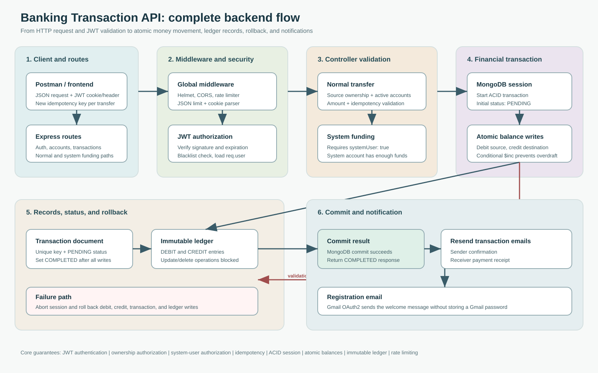
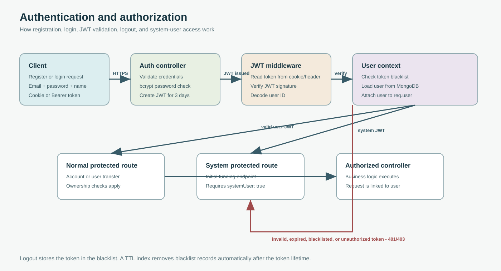
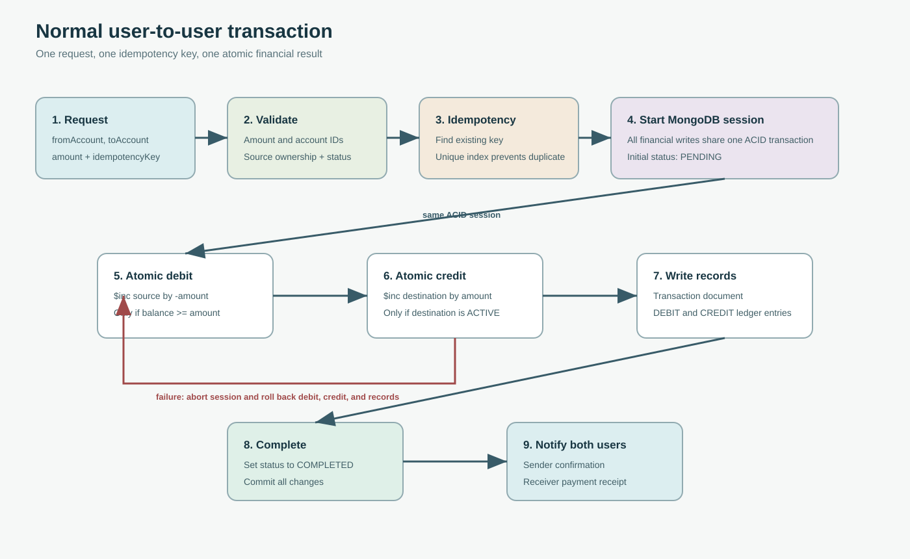
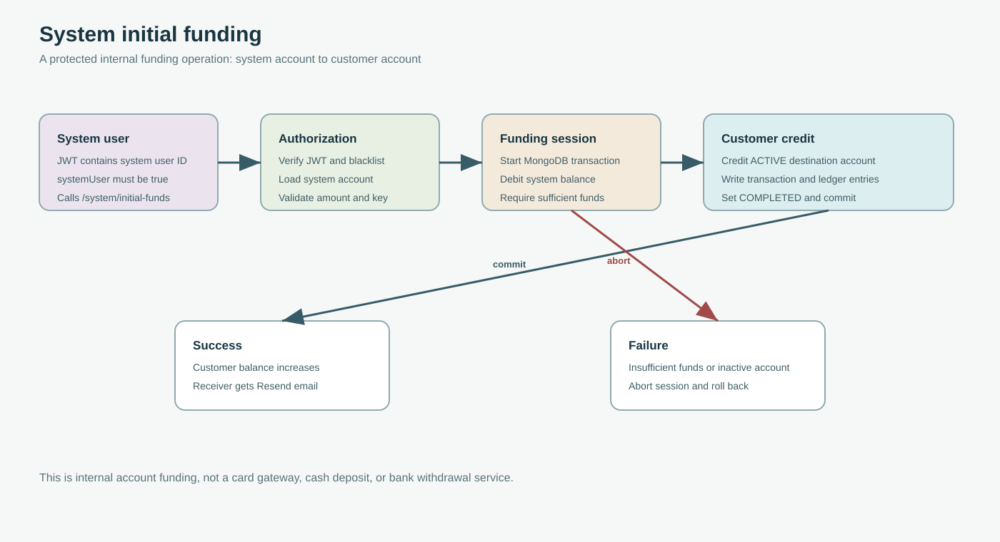

# Banking Transaction API

A secure, transaction-focused REST API built with Node.js, Express, and MongoDB. It models user accounts, internal funding, transfers, immutable ledger entries, and email notifications.

> This is a banking-style backend project for learning, portfolio, and system-design demonstrations. It is not a regulated banking platform.

## Backend Flow Diagrams

### Complete API Overview



### Authentication



### Normal Transaction



### System Funding



## Key Features

- User registration, login, and logout
- JWT authentication through secure cookies or Bearer tokens
- Password hashing with `bcryptjs`
- User-owned account creation and balance lookup
- System-user initial funding flow
- User-to-user money transfers
- Atomic balance changes with MongoDB transactions
- Idempotency protection against duplicate transfers
- Immutable debit and credit ledger entries
- Transaction states: `PENDING`, `COMPLETED`, `FAILED`, and `REVERSED`
- Sender and receiver transaction emails through Resend
- Registration welcome emails through Gmail OAuth2
- Helmet security headers, CORS, rate limiting, and JSON body-size limits
- MongoDB indexes for common account, transaction, user, and ledger queries

## Technology And Responsibility

| Technology | Used for |
| --- | --- |
| Node.js | JavaScript runtime for the API server |
| Express | HTTP server, routing, middleware, and error handling |
| MongoDB | Persistent storage for users, accounts, transactions, and ledger entries |
| Mongoose | Schemas, validation, indexes, and MongoDB sessions |
| JWT | Stateless authentication tokens |
| Cookies | HTTP-only token storage for browser clients |
| bcryptjs | Password hashing and password verification |
| Helmet | Secure HTTP response headers |
| CORS | Controlled cross-origin access |
| express-rate-limit | Limits repeated requests |
| Nodemailer + Gmail OAuth2 | Registration welcome emails |
| Resend | Transaction and system-funding emails |

## Email Authentication

The project intentionally uses two email providers:

- **Gmail OAuth2:** sends registration welcome emails. OAuth2 uses `CLIENT_ID`, `CLIENT_SECRET`, `REFRESH_TOKEN`, and `EMAIL_USER`, so the app does not store a Gmail password.
- **Resend API:** sends normal transfer and system-funding emails. Resend uses `RESEND_API_KEY` and `EMAIL_FROM`.

Gmail OAuth2 authenticates the application with Google. Resend authenticates the application with an API key. Render only runs the API; it is not an email provider.

## Architecture

The main request flow is:

1. A user registers and receives a JWT.
2. The user logs in and sends the JWT with protected requests.
3. The account service creates accounts linked to `req.user`.
4. A transfer validates ownership, destination, status, amount, and idempotency.
5. MongoDB atomically debits the source and credits the destination.
6. The transaction and its debit/credit ledger entries are stored in one database transaction.
7. The transaction is marked `COMPLETED` and the session is committed.
8. Resend notifies both the sender and receiver.

## Security And Reliability Concepts

### JWT authentication

Login creates a JWT containing the user ID. Protected middleware verifies the token, loads the user, and attaches it to `req.user`. Logout blacklists the token until its TTL expires.

### Authorization

Normal account operations are scoped to the authenticated user. The system funding route requires a user with `systemUser: true`.

### ACID transaction processing

Transfers use a MongoDB session transaction. The debit, credit, transaction record, ledger entries, and final status update commit together or roll back together. This prevents a successful debit without a matching credit.

### Atomic balance updates

Balance changes use conditional `$inc` operations. The source update requires `balance: { $gte: amount }`, so concurrent requests cannot spend the same funds beyond the available balance.

### Idempotency

Every transfer requires a unique `idempotencyKey`. Reusing the same key returns the existing transaction instead of creating a duplicate transfer. Use a new key for every new business transaction.

### Immutable ledger

Ledger entries are append-only. Update and delete hooks reject attempts to modify or remove financial history.

### Rate limiting and request limits

The API applies a global rate limiter and limits JSON request bodies to `1mb` to reduce abuse and oversized payloads.

## API Endpoints

Base URL: `http://localhost:3000`

### Authentication

| Method | Endpoint | Auth |
| --- | --- | --- |
| `POST` | `/api/auth/register` | Public |
| `POST` | `/api/auth/login` | Public |
| `POST` | `/api/auth/logout` | JWT |

### Accounts

| Method | Endpoint | Auth |
| --- | --- | --- |
| `POST` | `/api/accounts` | JWT |
| `GET` | `/api/accounts` | JWT |
| `GET` | `/api/accounts/balance/:accountId` | JWT |

### Transactions

| Method | Endpoint | Auth |
| --- | --- | --- |
| `POST` | `/api/transactions` | JWT |
| `POST` | `/api/transactions/system/initial-funds` | System-user JWT |

```

For Resend testing, the recipient may be restricted to the Resend account owner until a domain is verified. For production, verify a domain and use a sender address from that domain.

## Postman Testing Order

1. Register a normal user.
2. Login and save the returned JWT or cookie.
3. Create an account.
4. Login as a system user.
5. Create or use the system account with sufficient balance.
6. Call system initial funding for the normal user's account.
7. Check the normal user's balance.
8. Login as the sending user and transfer to the receiving account.
9. Verify both sender and receiver emails.
10. Repeat with the same idempotency key and confirm no duplicate transfer is created.
11. Test insufficient balance, invalid account, inactive account, and unauthorized access.

Use a fresh `idempotencyKey` for every new transfer.

If **Share** does not offer a public link, export the collection JSON and upload it to the repository, or create a Postman public documentation link from the collection's **View documentation** or **Publish docs** option. Workspace and Postman plan permissions can control which sharing options are available.

Postman collection: [Banking Transaction API](https://www.postman.com/aditya-7156415/workspace/banking-transaction-api/collection/46713006-ebe4baa9-a463-43c5-8104-7284c964e6d4?action=share&creator=46713006)

The provided link currently points to one collection containing the API requests. If Authentication and Accounts are separate collections, share each collection separately and add both links here.


## Project Status

This project demonstrates secure API fundamentals and reliable internal transfer processing. A real financial product would additionally require KYC, authorization roles, audit controls, reconciliation, fraud monitoring, external payment rails, observability, backups, compliance controls, and extensive automated tests.

